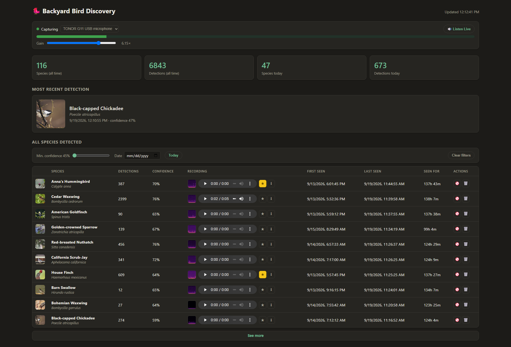
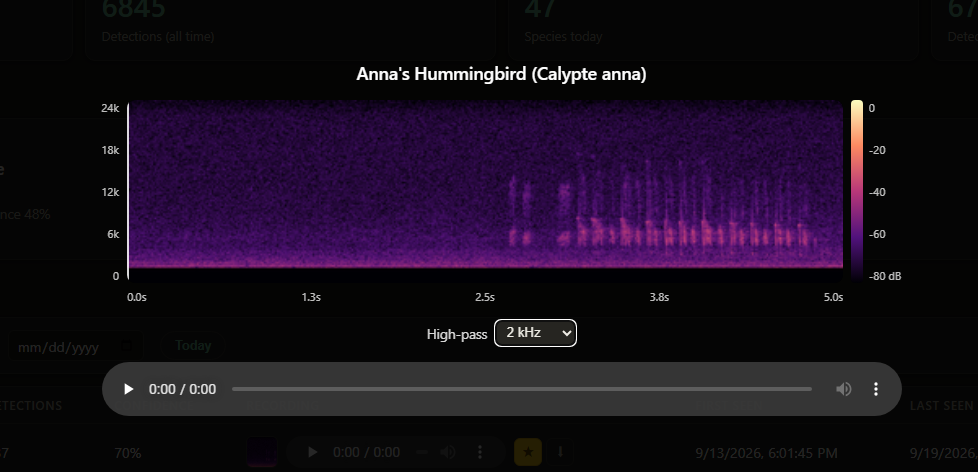
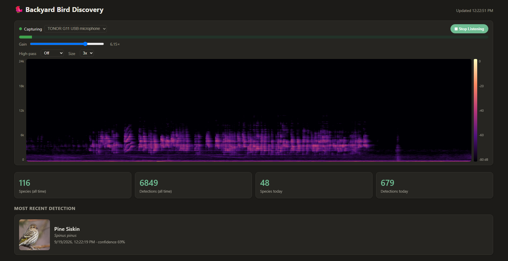

Per-species recording detail (frequency/time axes, dB color key, a
per-species-remembered high-pass filter):



Real-time waterfall spectrogram while "Listen Live" plays (same axes/key,
a high-pass filter, and a 1x/2x/3x size control):



# Backyard Bird Discovery System

Local-first pipeline: outdoor microphone → BirdNET-Analyzer → SQLite
detection timeline → daily slideshow → Euphro WF1561 photo frame.

Full requirements and architecture: [`Backyard_Bird_Discovery_System_Requirements.md`](Backyard_Bird_Discovery_System_Requirements.md).
Development rules: [`CLAUDE.md`](CLAUDE.md).
Full build history, real bugs found, and how each feature was actually
validated: [`DEVELOPMENT.md`](DEVELOPMENT.md).

## Status

Working end-to-end and validated on real hardware — a Mac mini and a
Raspberry Pi 4B, both with a real USB microphone:

- Continuous audio capture → BirdNET species identification → a
  searchable SQLite detection timeline, with duplicate suppression,
  crash recovery, and disk-space-aware retention.
- Automatic bird-photo acquisition and caching (Wikimedia Commons,
  iNaturalist), plus a saved "best recording" audio clip per species.
- A live status dashboard (`bird-display dashboard run`): detection
  stats, a per-species table with photo/audio/reject/delete controls,
  and a live microphone level meter with a real-time "Listen Live"
  audio button.
- `bird-display setup` — an interactive wizard for location (geocoded
  from a city/state/ZIP) and microphone selection.
- `bird-display services install` — boot-time auto-start via systemd
  (Linux) or launchd (macOS); both platforms also support the manual
  `scripts/start_all.sh`/`stop_all.sh` launcher (still what the Mac
  profile uses day to day — see Setup below).
- Two host profiles: macOS (Apple Silicon) and Ubuntu 24.04 LTS
  (aarch64, e.g. a Raspberry Pi 4B), with the right BirdNET backend
  (`tensorflow` vs. the much lighter `tflite-runtime`) picked
  automatically per platform.

Not yet built: daily species aggregation, the daily slideshow builder,
and the Euphro WF1561 photo-frame delivery adapter (§29 Phases 5–7 of
the requirements doc).

See [`DEVELOPMENT.md`](DEVELOPMENT.md) for the full phase-by-phase
history — every real bug found (many only surfaced by actually running
this against real hardware), and exactly how each feature was
validated rather than just assumed to work.

## Setup

Two host profiles are supported (requirements §7.1): a macOS host
(Apple Silicon recommended) and an Ubuntu 24.04 LTS (aarch64) Linux
host such as a Raspberry Pi 4B. Both need Python 3.9–3.11
(tensorflow's/tflite-runtime's supported range — Ubuntu 24.04's
default `python3` is 3.12, too new; see below) and
[git](https://git-scm.com) to clone this repo, and a working
microphone.

```bash
git clone <this repo>
cd birdbrain
./scripts/install.sh
source .venv/bin/activate
cp config/config.example.yaml config/config.yaml   # done automatically by install.sh if missing
```

`install.sh` detects the OS and branches accordingly:

- **macOS**: uses full `tensorflow` as the BirdNET backend (no
  official macOS arm64 `tflite-runtime` wheels exist); offers to
  `brew install python@3.11` if no compatible interpreter is found.
- **Linux (Ubuntu)**: uses the much lighter `tflite-runtime` instead
  (official aarch64 wheels exist, and it's a better fit for a
  resource-constrained host like a 4 GB Pi — `birdnetlib` prefers it
  automatically whenever it's importable); installs `libportaudio2`,
  `libsndfile1`, and the matching `python3.<minor>-venv` package via
  `apt-get`; offers to add the `deadsnakes` PPA and install Python 3.11
  if the system's default `python3` is out of range (as it is on
  Ubuntu 24.04).

`install.sh` does more than create a venv:

0. Fails fast on things no amount of retrying fixes: wrong OS, or too
   little free disk space to survive the dependency download without
   a confusing mid-install "no space left on device" error.
1. Looks for a compatible Python (3.9–3.11) before creating the venv,
   since a newer default `python3` would fail obscurely at the
   tensorflow install step. If none is found and Homebrew is
   available, it offers to `brew install python@3.11` for you.
2. Installs the project (`pip install -e ".[dev]"`).
3. Verifies BirdNET actually works — not just that pip succeeded.
   BirdNET-Analyzer's model ships inside the `birdnetlib` wheel
   itself, so there's no separate "install BirdNET" step; what
   matters is confirming the model loads and can analyze audio. If no
   sample WAV is present under `tests/sample_audio/`, it offers to
   fetch BirdNET-Analyzer's own example clip
   (kahst/BirdNET-Analyzer, Apache-2.0) to test against.
4. Runs `bird-display doctor` as a final go/no-go gate and stops with
   guidance if anything fails.

Re-run `bird-display doctor` any time to re-check the environment:
platform, Python version, BirdNET, required directories, disk space,
audio-device availability, and — separately, since listing devices
needs no permission but recording does — whether this process can
actually open the microphone.

### First-run gotchas not fully automatable

- **The macOS microphone permission prompt.** The very first time
  anything in this project tries to record (`bird-display doctor`,
  `audio test`, or `capture run`), macOS should prompt you to allow
  microphone access for your terminal app. If it doesn't prompt (some
  macOS versions silently deny instead), `doctor`'s
  `microphone_permission` check will tell you — go to **System
  Settings → Privacy & Security → Microphone** and enable it for
  Terminal/iTerm yourself.
- **The Xcode Command Line Tools popup.** If this is a fresh Mac and
  you've never run `python3`/`git` from Terminal before, the *first*
  invocation can pop up a system dialog offering to install
  "Command Line Developer Tools." That's expected — let it finish,
  then re-run `./scripts/install.sh`.
- **Intel Macs**: `doctor`'s `platform` check will warn rather than
  fail. Every pinned dependency (tensorflow included) publishes an
  x86_64 wheel, so `pip install` is expected to succeed — but this
  project is only developed and tested on Apple Silicon, so runtime
  behavior there (BirdNET performance, audio device handling) isn't
  verified. Please open an issue if you hit something on Intel.
- **The `apt-get`/`add-apt-repository` sudo prompts on Linux.** Adding
  the `deadsnakes` PPA and installing system packages needs root —
  `install.sh` shells out to `sudo` for these steps, so expect a
  password prompt (or run the script as a user with passwordless
  sudo).
- **No microphone permission prompt on Linux** — there's no TCC-style
  dialog to answer. If `doctor`'s `microphone_permission` check fails,
  it's almost always that the user isn't in the `audio` group yet
  (`sudo usermod -aG audio $USER`, then log out and back in).

`install.sh` offers to run `bird-display setup` right after creating
`config.yaml` — an interactive wizard that geocodes a city/state/ZIP
into `location.latitude`/`location.longitude` and lets you pick a
detected microphone by name, instead of hand-editing those two fields.
Run it again any time (`bird-display setup`) to change either. If you
skip it, edit `config/config.yaml` directly: at minimum set
`location.latitude`/`location.longitude` and `audio.device_name` for
your installation.

### Uninstalling

```bash
./scripts/uninstall.sh                    # stops services, removes .venv/
./scripts/uninstall.sh --purge-data       # also deletes data/ and config/config.yaml
                                           # (detection database, captured audio, images —
                                           #  confirmed interactively; add --yes to skip that)
```

## Running everything (desktop launcher)

**Start Backyard Birds.command** and **Stop Backyard Birds.command** on
the Desktop start/stop capture, the analyzer, and the dashboard
together — double-click after a cold boot to get going, no Terminal
typing required. Each is a thin wrapper around the real logic in
`scripts/start_all.sh`/`stop_all.sh` (tracked in the repo, so updating
the project updates what the launcher does); the Desktop files
themselves never need to change.

- Safe to double-click more than once — already-running services are
  detected (by PID file, cross-checked against the actual process
  command so a reused PID after reboot can't false-positive) and
  skipped rather than duplicated.
- Services keep running after you close the Terminal window that
  opens — that window is just for startup visibility (migrations
  applied, each service's PID, any immediate errors), not something
  you need to keep open.
- Logs land in `data/logs/<service>.out.log` (stdout/stderr) alongside
  the structured JSON logs each service already writes via
  `logging_config.py`.
- `bird-display images watch` starts too (§15.1) — it polls every 10
  minutes for species with no photo yet and fetches one automatically,
  so a newly detected species' image appears on the dashboard without
  you running anything manually. This isn't the same load as
  `images fetch-missing` run repeatedly by hand — it only ever acts on
  species that actually need it.
- This is the manual launcher. `bird-display services install` (§29
  Phase 8) also exists now, for boot-time auto-start via `systemd`
  (Linux) or `launchd` (macOS) instead — see Usage below. Both
  approaches work; this one just doesn't need touching a system
  service manager.

This needs to be run at the actual console (double-clicked locally) on
macOS specifically: macOS blocks microphone capture entirely for any
process without an attached GUI session, so an SSH-run `capture run`
gets silent audio with no error — confirmed the hard way (see
[`DEVELOPMENT.md`](DEVELOPMENT.md#microphone-2026-08-16) for the full
story). Linux has no such restriction; a Raspberry Pi's services can
run headless over plain SSH with no console/GUI involved at all.

## Usage

```bash
bird-display setup             # interactive: location + microphone
bird-display services install  # auto-start on boot (systemd/launchd)
bird-display services status
bird-display doctor
bird-display config validate
bird-display audio list-devices
bird-display audio test --seconds 5
bird-display capture run
bird-display analyze run
bird-display dashboard run
bird-display dashboard run --reload  # dev only: auto-restarts on routes.py/repositories.py edits
bird-display images fetch-missing
```

See `bird-display --help` (and `--help` on any subcommand/group) for
the full, current list — this section is deliberately short rather
than duplicating it and drifting out of date.

## Tests

```bash
pytest                              # unit tests
pytest -m integration               # also runs the real BirdNET model
                                     # (needs a sample WAV — see
                                     # tests/sample_audio/README.md)
```

## License

[MIT](LICENSE).
